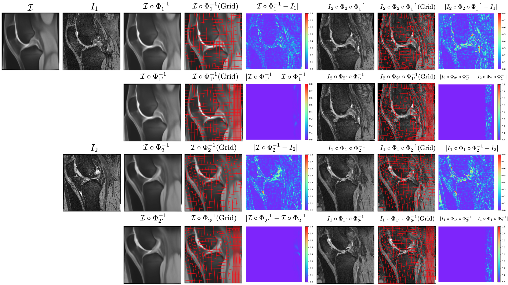
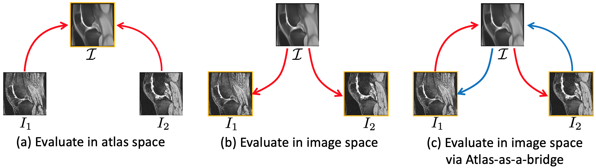
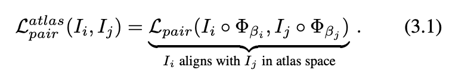
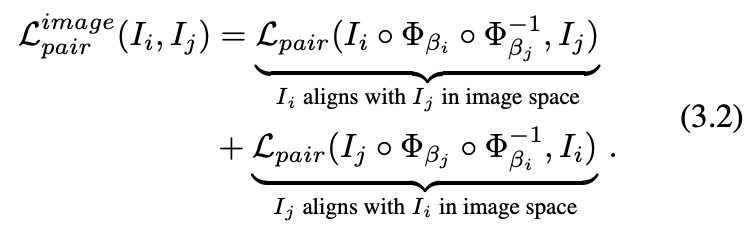
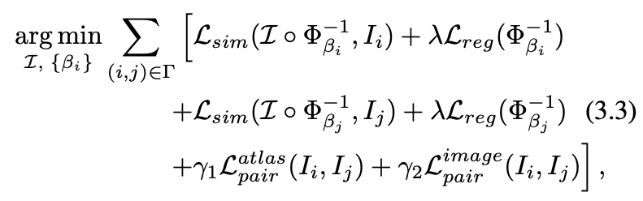
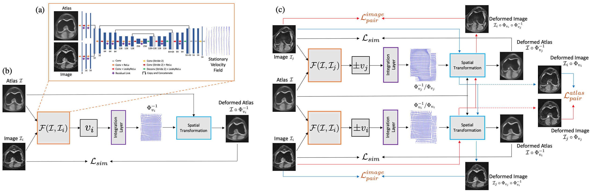
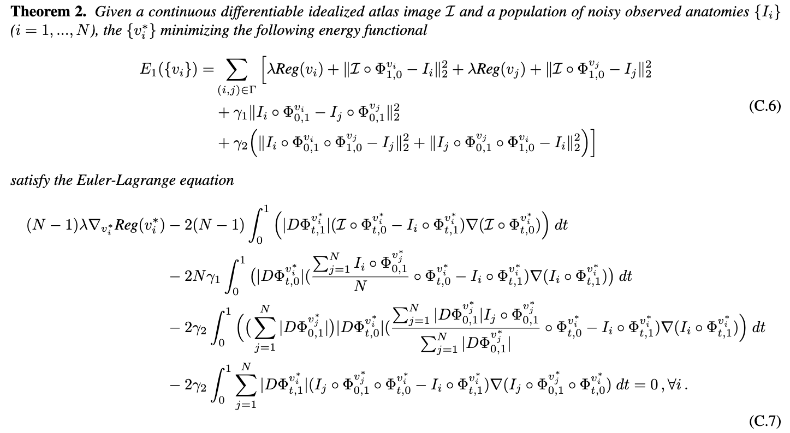
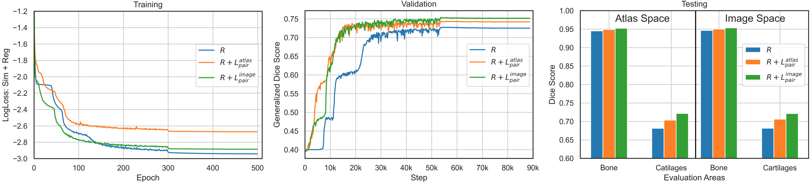
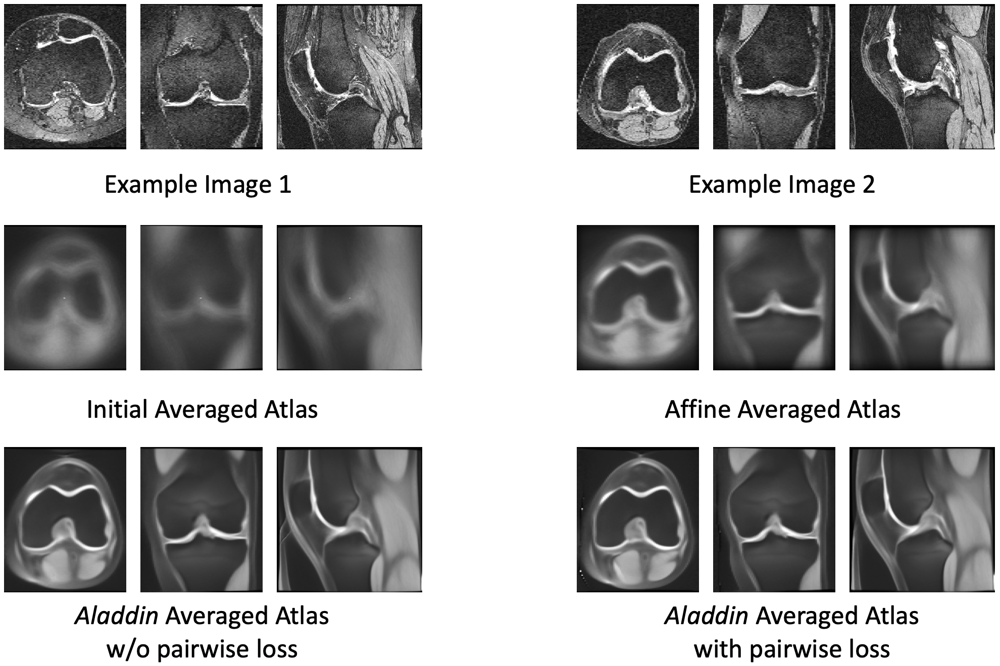
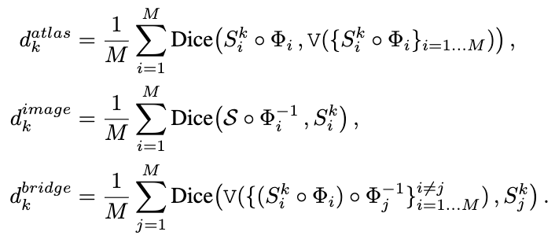

# Aladdin
joint **A**t**LA**s buil**D**ing and **D**iffeomorphic reg**I**stration lear**N**ing with pairwise alignment

This is the official repository for   

**Aladdin: Joint Atlas Building and Diffeomorphic Registration Learning with Pairwise Alignment**   
[Zhipeng Ding](https://biag.cs.unc.edu/author/zhipeng-ding/) and [Marc Niethammer](https://biag.cs.unc.edu/author/marc-niethammer/)   
*CVPR 2022* [eprint arxiv](https://arxiv.org/abs/2202.03563)   

If you use Aladdin or some part of the code. please cite:
```
@article{ding2022aladdin,
  title={Aladdin: Joint Atlas Building and Diffeomorphic Registration Learning with Pairwise Alignment},
  author={Ding, Zhipeng and Niethammer, Marc},
  journal={arXiv preprint arXiv:2202.03563},
  year={2022}
}
```

## Key Observations
1. **(Similarity Measure)** Previous approaches for atlas building often define similarity measures between a fuzzy atlas and each individual image, which may cause alignment difficulties because a fuzzy atlas does not exhibit clear anatomical structures in contrast to the individual images. Hence, we propose pairwise image similarity loss to help the alignment. We hypothesize that incorporating a pairwise image similarity loss is beneficial for alignment accuracy.

<p align="center">
  
</p>


> In the above figure, we can clearly see that image-to-image differences are greater than atlas-to-image differences. Hence, an image-to-image similarity measure is expected to provide more alignment information than an atlas-to-image similarity measure because a fuzzy atlas does not exhibit the clear anatomic structures present in individual images. Detailed explanations can be found in the paper. 


2. **(Evaluation)** The quality of an atlas is usually evaluated in combination with the quality of the image registration algorithm. For example, an atlas framework is often evaluated based on the sharpness or entropy of the atlas, the alignment of test images in the atlas space, or the alignment of the warped atlas in test image space. These evaluation measures all have shortcomings (see the paper for details). Therefore, we propose *atlas-as-a-bridge* measure which is conceptually preferable to existing evaluation measures.

<p align="center">
  
</p>


> In the above figure, we demonstrate our proposed evaluation measure with other two commonly used measures. Evaluation on atlas space will accumulate both atlas variations and registration errors; evaluation on image space will accumulate both the estimated segmentation errors and registration errors; and using atlas-as-a-bridge will only accumulate registration errors. Hence, the proposed measure is preferable. See deatailed explanations in the paper.


3. **(Pre-processing)** Most existing atlas building methods rely on affine pre-registrations to a chosen reference image. Instead of separately considering affine and nonparametric transformations, we propose to predict a transformation which includes affine and nonparametric deformations. To achieve this goal, we used bending energy as the regularization term. We hypothesize that our combined transformation prediction is as accurate as methods that treat affine and nonparametric transformations separately.

## Pairwise Alignment
Inspired by *backward* atlas building, we propose the first pairwise alignment loss in *atlas space* as:
<p align="center">
  
</p>

Inspired by *forward* atlas building, we propose the second pairwise alignment loss in *image space* as:
<p align="center">
  
</p>

Thus, a *forward* atlas building model with pairwise image alignment can be formulated as:
<p align="center">
  
</p>

This is demonstrated in the following architecture of our proposed model
<p align="center">
  
</p>

> In the above figure, (b) is a standard forward atlas building architecture; (c) is our proposed model with pairwise image alignment losses.  Our model extends the standard model by incorporating pairwise image losses and by computing their alignments in atlas space as well as in image space using the atlas as a bridge. See details in the paper.

## Theoretical and Emprical Justification
The benefit of using pairwise image alignment losses are illustrated by using Euler-Lagrange equation. Specifically, we can prove that
<p align="center">
  
</p>
At optimality the Euler-Lagrange equations need to be hold. Therefore, within the iterative updating schema, adding pairwise terms will speed-up the convergence of the stationary velocity field. See details in the paper. we design a simple experiment to compare a vanilla atlas-to-image registration model to show improvements obtained by the pairwise loss terms. The results are highlighted in below
<p align="center">
  
</p>

> In the above figure, We notice that both pairwise alignment terms speed-up the convergence and increase the overall performance. The pairwise alignment term in image space performs better than the pairwise alignment term in atlas space. See details in the paper.

## Example Atlas Building Results
The following figure shows the atlas building results with and without pairwise alignment terms. Deatiled quantitative results can be found in the paper.
<p align="center">
  
</p>

## Evaluation Criteria
As discussed in the above, we propose atlas-as-a-bridge measure to evaluate the performance of atlas building framework. Specifically, the following figure is the mathematical expression of evaluations in different ways and our proposed measure is preferable than traditional evalution measures. See details in the paper.
<p align="center">
  
</p>

## Implementation
Source coude is provided at the [code](https://github.com/uncbiag/Aladdin/tree/main/code) folder.
For training,
```
python SVF_train_forward_atlas.py --epochs 500 --batch-size 2 --lr 1e-4 --sim-factor 10.0 --reg-factor 20000.0 --atlas-pair-sim-factor 0.0 --image-pair-sim-factor 0.0 --seed 2021 --gpu 0 --sim-loss SSD --save-per-epoch 10
```

For evaluation,
```
python SVF_test_forward_atlas_example.py
python Analyze_atlas_as_bridge_forward_network.py
```


